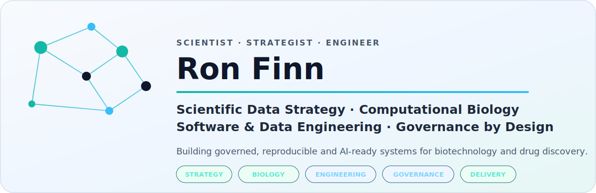
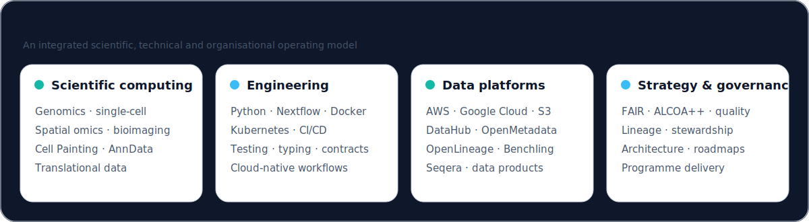
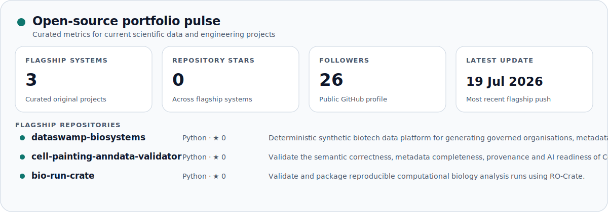
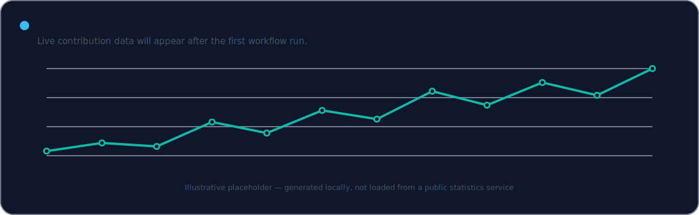

<picture>
  <source media="(prefers-color-scheme: dark)" srcset="./assets/hero-dark.svg">
  <source media="(prefers-color-scheme: light)" srcset="./assets/hero-light.svg">
  
</picture>

  <a href="https://github.com/ronfinn/dataswamp-biosystems"><strong>Data Swamp Biosystems</strong></a>
  &nbsp;·&nbsp;
  <a href="https://github.com/ronfinn/cell-painting-anndata-validator"><strong>Cell Painting AnnData Validator</strong></a>
  &nbsp;·&nbsp;
  <a href="https://github.com/ronfinn/bio-run-crate"><strong>Bio Run Crate</strong></a>

## Building trustworthy scientific data systems

I work across scientific research, data strategy and software engineering.
My focus is making complex research data **discoverable, reproducible,
traceable and ready for responsible AI/ML use**.

<table>
  <tr>
    <td width="50%" valign="top">
      <h3>Scientific data strategy</h3>
      

        Target operating models, platform architecture, data products,
        metadata strategy, stewardship and governance-as-code.
      

    </td>
    <td width="50%" valign="top">
      <h3>Computational biology</h3>
      

        Genomics, single-cell and spatial omics, bioimaging, phenotypic
        profiling and translational research data.
      

    </td>
  </tr>
  <tr>
    <td width="50%" valign="top">
      <h3>Software and data engineering</h3>
      

        Typed Python, validation tooling, Nextflow, containers, cloud
        platforms, CI/CD and reproducible scientific workflows.
      

    </td>
    <td width="50%" valign="top">
      <h3>Programme delivery</h3>
      

        Technical roadmaps, architecture decisions, cross-functional
        delivery, platform evaluation and measurable governance outcomes.
      

    </td>
  </tr>
</table>

<picture>
  <source media="(prefers-color-scheme: dark)" srcset="./assets/capability-map-dark.svg">
  <source media="(prefers-color-scheme: light)" srcset="./assets/capability-map-light.svg">
  
</picture>

## Flagship open-source systems

<table>
  <tr>
    <td width="50%" valign="top">
      <h3>
        <a href="https://github.com/ronfinn/dataswamp-biosystems">
          Data Swamp Biosystems
        </a>
      </h3>
      

        A deterministic synthetic biotech data estate for benchmarking
        catalogues, lineage systems, governance controls and AI agents.
      

      
<code>synthetic-data</code> <code>data-governance</code> <code>AI agents</code>

    </td>
    <td width="50%" valign="top">
      <h3>
        <a href="https://github.com/ronfinn/cell-painting-anndata-validator">
          Cell Painting AnnData Validator
        </a>
      </h3>
      

        Semantic, provenance and AI-readiness validation for Cell Painting
        datasets represented as AnnData.
      

      
<code>anndata</code> <code>phenotypic-profiling</code> <code>validation</code>

    </td>
  </tr>
  <tr>
    <td width="50%" valign="top">
      <h3>
        <a href="https://github.com/ronfinn/bio-run-crate">
          Bio Run Crate
        </a>
      </h3>
      

        Validation of biological analysis-run metadata and packaging of
        traceable outputs as RO-Crate research objects.
      

      
<code>RO-Crate</code> <code>FAIR</code> <code>reproducibility</code>

    </td>
    <td width="50%" valign="top">
      <h3>Current design direction</h3>
      

        Connecting metadata contracts, scientific workflow execution,
        quality controls, provenance and governed reuse into coherent
        research data products.
      

      
<code>metadata-contracts</code> <code>lineage</code> <code>data-products</code>

    </td>
  </tr>
</table>

## Open-source portfolio pulse

<picture>
  <source media="(prefers-color-scheme: dark)" srcset="./assets/profile-stats-dark.svg">
  <source media="(prefers-color-scheme: light)" srcset="./assets/profile-stats-light.svg">
  
</picture>

<picture>
  <source media="(prefers-color-scheme: dark)" srcset="./assets/activity-dark.svg">
  <source media="(prefers-color-scheme: light)" srcset="./assets/activity-light.svg">
  
</picture>

  The two panels above are generated as local SVG files by GitHub Actions.
  The profile does not depend on a public badge or statistics-image service.

## Engineering principles

- **Contracts before convenience:** make schemas, interfaces and expectations explicit.
- **Reproducibility by default:** deterministic execution, versioned configuration and traceable outputs.
- **Governance in the workflow:** validation, lineage, ownership and quality controls belong in the delivery path.
- **Build for scientific users:** technically rigorous systems must remain understandable and usable by research teams.

## Technical landscape

**Scientific computing**  
Python · R · AnnData · Scanpy · Squidpy · Cell Painting · single-cell omics ·
spatial transcriptomics · bioimaging

**Engineering**  
Nextflow · Docker · Kubernetes · GitHub Actions · pytest · Ruff · mypy ·
Pydantic · uv

**Data platforms**  
AWS · Google Cloud · S3 · DataHub · OpenMetadata · OpenLineage · Benchling ·
Seqera

**Strategy and governance**  
FAIR · ALCOA++ · metadata management · data quality · data lineage ·
data products · stewardship · governance as code

---

  <strong>Scientific data should be understandable, reproducible and trustworthy by design.</strong>
   
  London, United Kingdom

